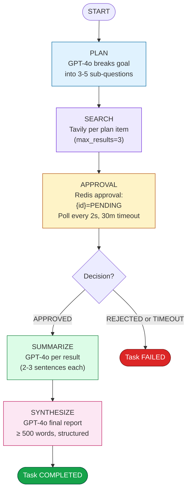
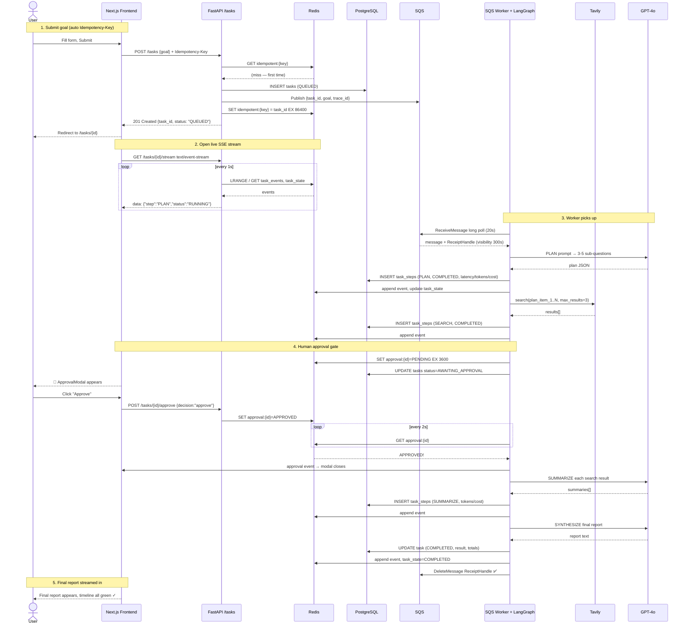
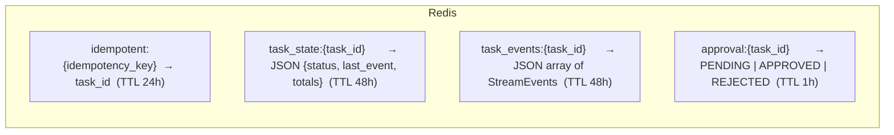

# AgentFlow

> **Production-grade AI task execution platform.** Give the agent a goal in plain English — it plans, searches the web, asks for your approval on sensitive steps, summarizes, and synthesizes a polished final report. Every step is streamed to the frontend in real time with full cost, token, and latency observability.

---

## 1. About

AgentFlow is a distributed agentic system built with the same primitives you would see in a real SaaS product — async queueing, dead-letter queues, idempotent APIs, Redis-backed state, structured JSON logging, trace IDs per request, LangGraph orchestration, and human-in-the-loop approvals.

It is intentionally small (a single FastAPI backend + a standalone SQS worker + a Next.js 14 dashboard) but every subsystem follows production conventions. It is designed to be directly deployable to EC2/RDS/ElastiCache and horizontally scalable: the worker is a standalone process, so you can run N consumer processes against the same SQS queue.

---

## 2. The Problem It Solves

Running a one-off GPT call in a Jupyter notebook is easy. Running a reliable, observable, approval-gated **agentic workflow** in production that 100 users can submit to simultaneously — that is where things break:

| Pain Point | Typical Failure |
|---|---|
| **Duplicate work on double-click / spotty Wi-Fi** | Same goal runs twice, burns 2x tokens, 2x cost. |
| **Crash in the middle of an agent run** | Partially computed task is lost, state is unclear. |
| **Agents taking external actions silently** | Agent calls an external URL / tool without user consent — trust is broken. |
| **No per-step observability** | "It's slow" — you can't tell which node, how many tokens, or how much USD was spent. |
| **Bursty traffic overwhelms the API process** | Worker work happens inside the request handler → timeouts and cascading failure. |
| **Failed tasks are just "gone"** | No retry mechanism, no dead-letter queue for triage. |
| **Mixed log formats (print() / console.log())** | Impossible to grep or build dashboards over. |

AgentFlow is a minimal reference implementation that solves **every one** of these problems with off-the-shelf infrastructure.

---

## 3. The Solution (How It Works)

1. **Idempotent submission.** Every `POST /tasks` call is required to carry an `Idempotency-Key` header. The key is checked against Redis **before** any DB write or queue publish. Re-submits within 24 hours return the *same* task id (HTTP 200, not 201).

2. **Async execution via queue.** The FastAPI process never runs LLM work. It inserts a `QUEUED` row into Postgres, publishes a message to AWS SQS, and returns immediately. A **separate consumer process** (run as its own systemd unit or container) long-polls SQS.

3. **Failure & DLQ semantics.** The consumer deletes a queue message **only after successful execution**. If the agent throws, the message is not deleted → SQS retries up to `Max Receive Count = 3`. On the 4th failure, SQS moves the message to the **Dead Letter Queue** automatically.

4. **Human-in-the-loop approval.** Before summarizing external search results, the agent explicitly sets `approval:{task_id} = PENDING` in Redis and **blocks polling** every 2 seconds. A modal appears in the dashboard. The user calls `POST /tasks/{id}/approve` → Redis flips to `APPROVED`/`REJECTED` → the agent either continues or aborts.

5. **Streaming UI.** `GET /tasks/{id}/stream` is a text/event-stream SSE endpoint that tails `task_events:{task_id}` in Redis every second. Every node writes RUNNING + COMPLETED events with `latency_ms`, `tokens`, and `cost_usd`. The browser StepTimeline re-renders instantly, no refresh needed.

6. **Per-node cost & latency tracking.** Every GPT-4o call tracks input + output tokens and applies a published `$/token` rate. All numbers are written to PostgreSQL's `task_steps` table and to structured JSON logs (tagged with `trace_id`).

---

## 4. Features

- ✅ **LangGraph agent graph**: `PLAN → SEARCH → APPROVAL → SUMMARIZE → SYNTHESIZE`
- ✅ **GPT-4o** for planning, summarization, and synthesis (with fallback stubs if API key is missing — great for local UI/dev work)
- ✅ **Tavily web search** with tenacity retry (3 attempts + exponential backoff)
- ✅ **Human-in-the-loop** approve / reject gate before summarization step
- ✅ **Real-time SSE streaming** step timeline with keepalive pings every 15s
- ✅ **PostgreSQL persistence** for tasks + per-step audit rows (latency, tokens, cost, output)
- ✅ **AWS SQS** for task queueing + separate **DLQ** (max receives = 3, visibility timeout = 300s)
- ✅ **Redis** for idempotency keys (24h TTL), task state (48h TTL), approval flags (1h TTL), and event streams
- ✅ **Idempotent POST /tasks** — safe for double-submits and spotty clients
- ✅ **Structured JSON logger** with `trace_id`, `task_id`, `step`, `latency_ms`, `tokens_used`, `cost_usd` on every line
- ✅ **FastAPI + Pydantic** request/response validation
- ✅ **Alembic** migrations
- ✅ **Next.js 14 App Router + Tailwind CSS** dashboard:
  - Home: goal form with 3 clickable example prompts
  - Task view: live step timeline + SSE stream + approval modal + final report pane
  - Dashboard: 4 KPI cards (total USD, tokens, completed, in-flight), paginated task history table

---

## 5. Architecture

### 5.1 System Architecture

```mermaid
flowchart LR
    subgraph User["🧑‍💻 User Browser"]
        UI[Next.js 14 + Tailwind]
    end

    subgraph Edge["🌐 Edge / HTTP"]
        LB[CORS / Nginx]
    end

    subgraph API["⚡ FastAPI Backend (stateless, horizontal scale)"]
        POST[POST /tasks]
        STREAM[GET /tasks/{id}/stream SSE]
        APPROVE[POST /tasks/{id}/approve]
        GET_TASK[GET /tasks + /{id}]
        HEALTH[GET /health /ready]
    end

    subgraph State["💾 State & Cache Layer"]
        direction LR
        REDIS[(Redis\nidempotency • task_state • approval • events)]
        PG[(PostgreSQL\n tasks • task_steps)]
    end

    subgraph Queue["📬 Async Queue"]
        SQS[(AWS SQS\n agentflow-tasks)]
        DLQ[(AWS SQS DLQ\n agentflow-tasks-dlq)]
        SQS -- "3x fails →" --> DLQ
    end

    subgraph Worker["🧠 N × SQS Worker Processes (stateless, horizontal scale)"]
        CONSUMER[SQS consumer long-poll]
        GRAPH[LangGraph Agent]
        LLM[GPT-4o]
        SEARCH[Tavily Search API]
    end

    UI -->|"1. Submit goal\n (POST /tasks, Idempotency-Key)"| LB --> POST
    POST -->|"2. Redis idempotency check"| REDIS
    POST -->|"3. Insert QUEUED"| PG
    POST -->|"4. Publish {task_id, goal, trace_id}"| SQS

    CONSUMER -->|"5. Long poll every 20s, VisibilityTimeout=300s"| SQS
    CONSUMER --> GRAPH
    GRAPH -->|plan / summarize / synthesize| LLM
    GRAPH -->|search| SEARCH
    GRAPH -->|"Write RUNNING + COMPLETED rows\nUpdate totals"| PG
    GRAPH -->|"Publish step events + state"| REDIS
    GRAPH -->|"Approval gate: set PENDING, poll every 2s"| REDIS

    UI -->|"6. Open SSE connection"| LB --> STREAM -->|"tail task_events Redis key / 1s"| REDIS
    UI -->|"7. Click Approve"| LB --> APPROVE -->|"SET approval:{id}=APPROVED/REJECTED"| REDIS

    GRAPH -->|"On success: delete message from SQS"| SQS
    GET_TASK --> PG
    HEALTH --> PG & REDIS & SQS
```

### 5.2 LangGraph Agent Flow (per-task node graph)



### 5.3 End-to-End Request Sequence



### 5.4 Redis Keyspace



### 5.5 Database Schema

```mermaid
erDiagram
    tasks {
        uuid id PK
        varchar trace_id UK
        text goal
        varchar status "QUEUED|RUNNING|AWAITING_APPROVAL|COMPLETED|FAILED"
        text result
        int total_tokens DEFAULT 0
        float total_cost_usd DEFAULT 0.0
        datetime created_at
        datetime updated_at
    }

    task_steps {
        uuid id PK
        uuid task_id FK
        varchar step_name "PLAN|SEARCH|APPROVAL|SUMMARIZE|SYNTHESIZE"
        varchar status "RUNNING|COMPLETED|FAILED|APPROVED|REJECTED|AWAITING_APPROVAL"
        int latency_ms
        int tokens_used
        float cost_usd
        text output
        datetime created_at
    }

    tasks ||--o{ task_steps : "has many"
```

---

## 6. Project Structure

```
agentflow/
├── frontend/                         # Next.js 14 App Router (TypeScript)
│   ├── app/
│   │   ├── layout.tsx                # Top nav + global Tailwind shell
│   │   ├── page.tsx                  # Landing = GoalInput (home /)
│   │   ├── tasks/[id]/page.tsx       # Live task view + SSE stream
│   │   ├── dashboard/page.tsx        # History + KPI cards + cost totals
│   │   └── globals.css
│   ├── components/
│   │   ├── GoalInput.tsx             # Goal textarea + examples + submit
│   │   ├── StepTimeline.tsx          # 5-step pipeline visualizer
│   │   ├── ApprovalModal.tsx         # Approve/Reject dialog
│   │   └── CostBadge.tsx             # Tokens + USD micro pill
│   └── lib/
│       ├── api.ts                    # axios + typed interfaces + UUID idempotency
│       └── sse.ts                    # EventSource wrapper (listener pattern)
│
├── backend/                          # FastAPI (Python 3.11+)
│   ├── main.py                       # FastAPI init, CORS, router include
│   ├── routers/
│   │   ├── tasks.py                  # POST /tasks, GET /tasks, GET /tasks/{id}
│   │   ├── stream.py                 # GET /tasks/{id}/stream SSE endpoint
│   │   ├── approve.py                # POST /tasks/{id}/approve
│   │   └── health.py                 # GET /health, GET /ready
│   ├── services/
│   │   ├── queue.py                  # SQS publish / receive / delete / DLQ depth
│   │   ├── cache.py                  # Redis get / set / set_json / get_json
│   │   └── idempotency.py            # check_idempotency, store_idempotency
│   ├── worker/
│   │   ├── consumer.py               # SQS long-poll loop; delete on success only
│   │   ├── agent.py                  # LangGraph graph: plan/search/approval/summarize/synthesize
│   │   └── tools.py                  # Tavily search (tenacity 3x retry)
│   ├── models/
│   │   └── task.py                   # SQLAlchemy Task + TaskStep
│   ├── schemas/
│   │   └── task.py                   # Pydantic Request/Response schemas
│   ├── core/
│   │   ├── config.py                 # pydantic-settings env vars
│   │   ├── database.py               # SQLAlchemy engine / SessionLocal / get_db
│   │   ├── logging.py                # Structured JSON logger
│   │   └── tracing.py                # Per-request trace_id contextvar
│   ├── alembic/
│   ├── alembic.ini
│   └── requirements.txt
│
└── infra/
    └── docker-compose.yml            # Local Postgres 15 + Redis 7
```

---

## 7. Stack

| Layer | Tech |
|---|---|
| Frontend | Next.js 14 (App Router) + Tailwind CSS + TypeScript |
| Backend API | FastAPI (Python 3.11+) |
| Agent Engine | LangGraph `StateGraph` |
| LLM | OpenAI GPT-4o via `langchain-openai` |
| Web Search | Tavily API (with 3× retry / exponential backoff) |
| Async Queue | AWS SQS (Main queue) + separate DLQ (max receives = 3, visibility 300 s) |
| Cache / State / Lock | Redis (idempotency keys, task_state, event stream, approval flag) |
| Database | PostgreSQL 15 (tasks + task_steps, SQLAlchemy + Alembic migrations) |
| Auth (Phase 6) | JWT access + refresh tokens (python-jose / passlib-bcrypt) |
| Observability | Structured JSON logs (trace_id + task_id + step on every line) |
| Deployment | Designed for: AWS EC2 + RDS (PostgreSQL) + ElastiCache (Redis) |
| CI/CD (Phase 6) | GitHub Actions → deploy to EC2 over SSH |

---

## 8. API Endpoints

```
POST   /tasks                    Submit a new goal (Idempotency-Key header required)
GET    /tasks                    Paginated list of all tasks
GET    /tasks/{id}               Task detail + its steps
GET    /tasks/{id}/stream        Server-Sent Events stream of live step updates
POST   /tasks/{id}/approve       Approve/reject a paused approval step
GET    /health                   Liveness  → {"status": "ok"}
GET    /ready                    Readiness → DB + Redis ping
```

### `POST /tasks`

**Headers**
```
Idempotency-Key: <uuid>        (required — prevents duplicates)
```

**Body**
```json
{ "goal": "Research impact of LLMs on SaaS pricing and write a 500-word report" }
```

**Response (201 Created on first submit, 200 OK on resubmit)**
```json
{
  "task_id": "b52e6622-2e2e-4d7a-88de-0d8d4c57a6a0",
  "trace_id": "trace-a1b2c3",
  "status": "QUEUED"
}
```

### `GET /tasks/{id}/stream` (SSE)

Streams newline-delimited JSON events:
```
data: {"step": "PLAN", "status": "COMPLETED", "latency_ms": 820, "tokens": 210, "cost_usd": 0.0012}
data: {"step": "SEARCH", "status": "RUNNING"}
data: {"step": "APPROVAL", "status": "AWAITING_APPROVAL", "message": "Agent wants to access external URLs. Approve?"}
data: {"step": "SYNTHESIZE", "status": "COMPLETED", "result": "Final report text here..."}
data: {"type": "keepalive", "timestamp": 1749999999}
```

### `POST /tasks/{id}/approve`

**Body**
```json
{ "decision": "approve" }   // or "reject"
```

**Response**
```json
{ "task_id": "b52e…", "decision": "APPROVED" }
```

---

## 9. Commit Convention

Every commit uses a prefix tag for simple, scanable history.

```
[ADD] goal input form with submit + loading state
[ADD] POST /tasks endpoint with Redis idempotency check
[ADD] LangGraph plan node with structured JSON logging
[FIX] SSE connection dropping on long tasks — added keepalive ping
[FIX] duplicate task created on double submit — idempotency key fix
[FIX] agent stuck in approval loop — Redis TTL was too short
```

---

## 10. Resume Bullets

Copy after project is 100% done for the Experience section:

- Built **AgentFlow**, a production-grade agentic task platform using **LangGraph + GPT-4o**, with async execution via **AWS SQS**, DLQ-based 3-retry failure recovery, and **Redis-backed idempotent task submission** safe for double-clicks and flaky clients.
- Implemented **human-in-the-loop approval flow** with real-time **SSE streaming** of per-step latency, token usage, and USD cost to a **Next.js 14** dashboard (goal form, live step timeline, approve/reject modal, cost KPIs, task history table).
- Designed distributed worker architecture with **structured JSON logging** (trace IDs, per-node cost metrics), **PostgreSQL** step persistence, `SQLAlchemy` + `Alembic` migrations, and GitHub Actions CI/CD to AWS EC2 + RDS + ElastiCache.
